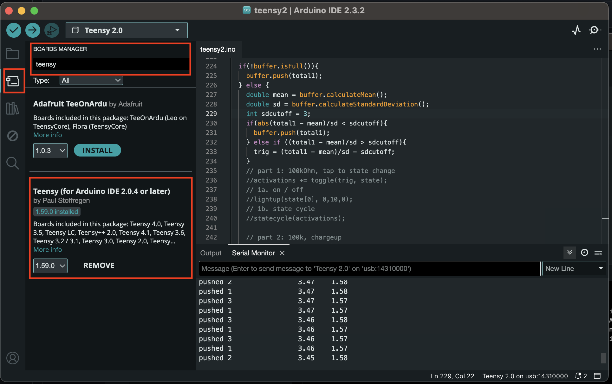

# A basic intro to capacitive touch sensors

Using some simple circuits, freely available arduino libraries, and a touch sensor that can be made out of readily available materials like tinfoil or even specially treated textiles, you can make a _capacitive touch sensor_ to integrate into interactive art and costuming projects. In this tutorial, we'll set up a simple circuit to accomplish this along with the basic theory on how this works, and set up a teensy microcontroller to generate a series of different effects on an LED strip based on user interactions with the touch sensor.

## Setting up the circuit & software

### Supplies

For this circuit, you'll need:

 - A teensy 2 (many, many other microcontollers will work just as well, but these instructions are written for the teensy 2).
 - a 100 kOhm resistor, and a 1 MOhm resistor.
 - a capacitive touch sensing foil, like a piece of textile teated with pyrrole, or even just a piece of tinfoil or mylar.
 - a ring of 16 neopixels (this is just for an example output; you can hook anything you want up to your capacitive touch sensing circuit).
 - a bunch of jumper wires
 - two double-sided alligator clips
 - 0.1 pitch male-male header pins if they aren't already soldered to your teensy
 - a USB cable with the right connections to connect your teensy to your laptop
 - [optional] a battery pack to run everything for projects not meant to be plugged into a wall outlet.

### Circuit construction

Set up your circuit as follows:


Once everything is hooked up, touch your textile capacitor. If everything is working correctly, your LED ring should turn on and off as you touch the textile, thanks to a simple program pre-loaded onto your microcontroller.

> **How does this work?** The circuit you built creates an *RC circuit* with the textile serving as the capacitor, which will be charged and discharged by the microcontroller. The key property of an RC circuit is that the time it takes to charge and discharge the capacitor is proportional to the product of the capacitance (C) and the resistance (R) in the circuit. The resistor is fixed; but if the capacitance changes, the time to charge and discharge will change. The software we'll use detects that change, and lets us control whatever other electronics we like based on that signal.
>
> But what's chaning the capacitance of the textile in the first place? Touching it, or even getting near it, changes the capacitance to a degree we can detect. Your body both adds dielectric to the existing capacitor formed by the textile, and acts itself as an additional capacitor in parallel in the circuit; both effects serve to increase the capacitance of the circuit, slowing down the charge and discharge time of the RC combination.

### Software setup

To control the details of how our microcontroller interprets capacitive touch signals and translates that to behavior on our LED ring, we're going to program it using the Arduino IDE (integrated development environment - if you've never seen something like this before, this is a tool that lets you write code and send it to your microcontroller in a form it can understand). Setup as follows:

1. Install the Arduino IDE, at least version 2.2.x.
2. We need to let the Arduino IDE know how to compile software for the teensy. Navigate **Arduino IDE -> Settings**, and under *Additional board manager URLs*, add `https://www.pjrc.com/teensy/package_teensy_index.json` to the list (separated from whatever else is in the list by a comma, if there's anything else there).
3. Click on the 'Boards Manager' icon on the left of the Arduino IDE (the left column will be titled 'BOARDS MANAGER' when you've chosen the correct one).
4. Type `teensy` in the search box in the boards manager column, and click *INSTALL* under 'Teensy (for Arduino IDE 2.0.4 or later)'. This will install what you need to communicate with your teensy.



5. Next, plug your microcontroller into your laptop with a USB cable. In the Arduino IDE, navigate *Tools -> Board -> Teensy (for Arduino IDE 2.0.4 or later) -> Teensy 2.0*
6. Also in the Arduino IDE, click on *Tools -> Port*, and select the port under *teensy ports*; there should only be one, and it should be labeled (Teensy 2.0).
7. At this point, your microcontroller is connected to your computer, and your Arduino IDE knows how to compile code in a way that the microcontroller will understand. Copy the contents of [this arduino code file](teensy2.ino) to the editor on the right hand side of the Arduino IDE, and click the rightward-pointing arrow near the top left to compile the code and send it to your microcontroller.
8. Finally, in the Arduino IDE, navigate *Tools -> Serial Monitor*. The serial monitor is where you can see your microcontroller sending messages back to your laptop; we'll use this feedback to understand the behavior of our capacitive touch sensor in what follows.

## Programming different LED behaviors

So far, we've only really used one of the effects pre-programmed onto your microcontroller: simply turning your LEDs on and off. There are several more you can switch between, in the following. Try each of them, and ask your instructor if you're curious how each of them work in more detail:

### Cycling through states

In your IDE, comment out example 1a (which was the default example you've already seen), and uncomment example 1b, which is an example of switching through preset states every time you touch the sensor; change this:

```
    // part 1: tap to state change
    // 1a. on / off
    lightup(int((activations%2)==1), 3,0,12);
    // 1b. state cycle
    //statecycle(activations);
```

to this:

```
    // part 1: tap to state change
    // 1a. on / off
    //lightup(int((activations%2)==1), 3,0,12);
    // 1b. state cycle
    statecycle(activations);
```

remember to hit the -> button in your IDE to send your code to your microcontroller. Both the on / off example we started with and this one simply count how many times you've touched the sensor, and change the LED state in response.

### Acting over time

The interactions we've seen so far have been instantaneous; what if we want a behavior that evolves or continues over time as the sensor is touched? Example number 2 is a simple example of this. Comment out the previous example, and uncomment out the `fraction_lightup` example for part 2. Once the code loads onto the microcontroller, try holding your hand on your touch sensor; the ring should fill up over a few seconds of interaction, and drain after removing your hand.

This example works by keeping track of how many loops of the microcontroller code in a row the sensor has been activated for, and lights up a corresponding fraction of the LED ring.

### Proximity sensing

So far, all of our examples are activated by touching our sensor; capactive sensors can also be used for proximity sensing, with some simple modifications.

1. Change the resistor in your circuit from the 100 kOhm to the 1 MOhm resistor. The resistance in a capacitive touch sensor multiplies the amount of time it takes to charge and discharge the sensor, which is what the software library is measuring and reacting to. By putting a larger resistor in the circuit, you magnify the otherwise small effect of moving your hand near the sensor. But be careful! You're also magnifying random noise from capacitance fluctiations, and slowing down how fast the overall circuit can react to changes.
2. Find the line in the microcontroller code that looks like `int sdcutoff = 20;` and change it to `int sdcutoff = 2;`. This number controls how sensitive your signal processing is to changes; large values result in low sensitivity and low noise, while low values make the logic react to small changes.
3. Send your modified code to your microcontroller agiain (rightward pointing arrow near the top right), and look at the serial monitor until it starts reporting reading again; they should be much larger than previously.
4. Finally, move your hand slowly towards your sensor; you should be able to trigger your LED ring from an inch or so away.

## Leaving the computer behind

So far, everything we've done has relied on being plugged into your computer - but what if we want capacitive textiles in a project not tethered to the computer, like in an interactive art piece, installation or costume? We can run the whole setup on a battery, but there's some additional tricks that might come in handy.

1. Take your battery holder and insert the provided batteries; there's an indicator inside the battey holder showing which way around to put the batteries.
2. Get a digital multimeter and use it to determine which of the wires coming out of the battery holder is the positive lead; your instructor will help you. Do not skip this step and do not guess if you're unsure; these *must* be the right way around before plugging in your microcontroller!
3. Insert the negative lead (white wire in the diagram) into the same row in the breadboard that has the white wire from the LEDs and microcontroller. 
4. Insert the positive lead (red wire in the diagram) into the same row in the breadboard that has the red wire from the LEDs and microcontroller.
5. Finally, attach a grounding wire to the ground rail on your breadboard (the row with all the ground wires, white in the diagram).

When complete, your circuit should look like this:


Try touching your capacitive textile - it might not work so well anymore! When you had your circuit plugged into the computer, it was using your computer's electrical ground; without this, the signals coming from the touch sensor and to the LED ring may be unstable and difficult to interpret due to the 'floating ground'. This is what the extra ground wire is for; try gripping it firmly in one hand while touching your sensor with the other, and it should behave much more stably (if you're still having trouble, hit the little reset button on the microcontroller and wait a moment for it to reboot and recalibrate). In something like a costume, this extra ground would be a 'body wire', typically discreetly taped to the skin to provide a stable ground (your body) for the electronics.

## Challenge exercise: make your own interactions and effects

At this point, you've tried all the basics: you've set up your circuit, seen a few basic effects it can generate, and ran it off a battery rather than from your computer. Finally, remove the battery pack, plug back into your computer with the USB cable, and go back to the code in your IDE. Try to see if you can make these modifications; work together with your classmates, and ask your instructor for tips if you get stuck:

1. Change the color of the LEDs in the simple on/off example.
2. Add another preset to the cycle in the state cycle example.
3. Make the 'discharge' step slower than the 'chargeup' step in the charge / discharge example

If you finish these, try coming up with your own interactions and seeing if you can program them; again, this is a challenging problem! Work together and ask your instructors for support.
